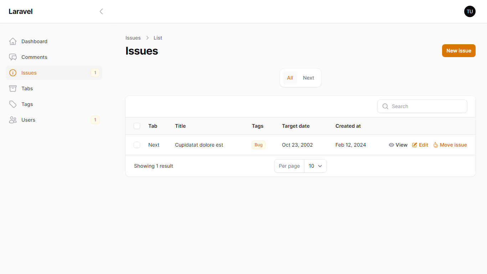

## Public facing roadmap platform to get user feedbacks on product features !

#### Taking feedbacks and suggestions from your userbase has never been this easier !

Welcome to the roadmap, Inspired by [Rowy Roadmap](https://roadmap.rowy.io/roadmap)

## Features 🔥

1.  Get feedback on your roadmap from public user groups or communities
2.  Upvote and downvote
3.  Comments
4.  Customizable categories/tabs : In progress, Next, Needs feedback, Release * Add as many as you want !
5.  Open-source, flexible and fully free
6.  Filamentphp CMS to manage issues, comments and users

-   upvotes, downvotes and comments !

-   Issue Timeline to track issue movement

-   Users can comment in the issue

#### How to use it ?

-   Fork it or download it

    > Get started in just five commands

1. Composer install
2. yarn install
3. php artisan migrate
4. php artisan db:seed
5. yarn dev
6. php artisan serve

-   Host on your own
-   Customize anything you want

#### Based on

-   [Mary-ui](https://mary-ui.com)
-   [Livewire](https://livewire.laravel.com)
-   [Filamentphp](https://filamentphp.com)

## Contributing

Send a PR ✉

## Security Vulnerabilities

If you discover a security vulnerability within this template, please send an e-mail to Pratik kuikel via [herecomeslucky0145@gmail.com](mailto:herecomeslucky0145@gmail.com). All security vulnerabilities will be promptly addressed.

## License

This project is open-sourced software licensed under the [MIT license](https://opensource.org/licenses/MIT).
